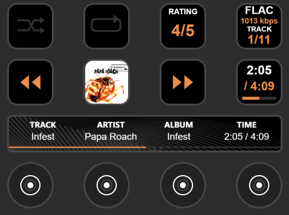
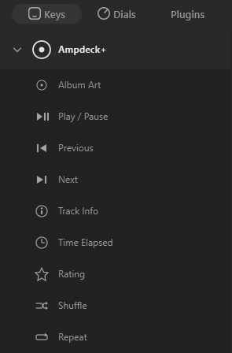
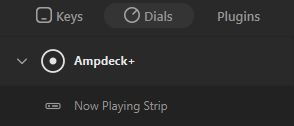

<h1 align="center">Ampdeck+ v2.0</h1>

<p align="center">
  <strong>The <em><strong>unofficial</strong></em> Plexamp plugin for Stream Deck</strong><br>
  <em>Ampdeck+ v2.0.0 is the first public release. Now with modular architecture, automatic reconnection, and clean code</em>
</p>

Ampdeck+ brings Plexamp to your Stream Deck. See your album art, track info, playback time, and rate your tracks on the LCD keys. All updated in real time. Stream Deck+ users get the full experience with a smooth animated progress bar spanning the touch strip and configurable dial controls.

<p align="center">
  
</p>

---


[](https://ko-fi.com/dreadheadhippy)
[](LICENSE)

---

## ⚡ What's New in v2.0

- **🏗️ Professional Architecture** - Complete modular rewrite with 12 specialized ES6 modules
- **🎬 Animated Seek Buttons** - Previous/Next buttons feature smooth directional animation during hold-to-seek with wrapping effect
- **🎨 Canvas-Rendered Navigation** - Next/Previous buttons rendered with dynamic accent colors that adapt to album art
- **🔧 Configurable Icon Sizes** - Choose from 4 icon size presets (24-48px) for navigation buttons
- **😴 Paused State Dimming** - All buttons automatically turn gray when playback is paused for clear visual feedback
- **📐 Symmetrical Spacing** - Professional layout with equal gaps throughout the UI: touch strip, Track Info, Time Elapsed, and overlays
- **📝 Enlarged Text** - Dramatically improved readability: Time display (42/40px), Track Info (36/26/24/42px), overlays (24/44px)
- **⭐ Enhanced Rating System** - Half-star increments, wrap-around from 5 to 0, and debounced saves for smooth server communication
- **👆 Touch Strip Tap-to-Pause** - Tap anywhere on the strip to play/pause
- **🎵 Album Art Interaction** - Tap album art tile to play/pause with gray overlay visual feedback
- **🔄 Automatic Reconnection** - Graceful WebSocket recovery if Stream Deck disconnects
- **✅ Input Validation** - Comprehensive validation for all user settings
- **📊 Centralized State** - Clean state management replacing 30+ scattered globals
- **🎯 Zero ESLint Warnings** - Production-quality code passing all checks
- **🛡️ Advanced Error Handling** - Graceful fallbacks and detailed logging system
- **📦 Modern Build System** - Rollup bundler with ES6+ features

---

## Features

- **Album Art** — Live album art on any LCD key with a pause overlay. Tap to play/pause. When playback is paused, the album art displays with a gray overlay.
- **Now Playing Strip** — Artist, album, track, or elapsed time on each touch strip panel with auto-scrolling for long text. Clean symmetrical spacing and enlarged text for better readability.
- **Dial Controls** — Configurable dial actions: rotate to skip tracks, adjust volume, or rate tracks. Press to play/pause, toggle shuffle, or cycle repeat.
- **Star Ratings** — Rate your tracks with half-star or full-star increments using the dial or dedicated rating button. Visual feedback shows the rating with stars. Ratings intelligently debounced for smooth server communication.
- **Rating Button** — Dedicated button showing the current track's star rating. Tap to cycle through ratings with configurable font size and increment mode (full star or half star). Wraps from 5 stars back to 0 for quick clearing.
- **Touch Strip Controls** — Tap anywhere on the strip to play/pause with visual feedback overlays showing the action taken. Symmetrical spacing throughout.
- **Spanning Progress Bar** — A single progress bar that flows across all 4 dials, with colors extracted from album art.
- **Play / Pause** — Dedicated button with instant visual feedback.
- **Previous / Next** — Tap to skip tracks. Hold for 400ms to activate seek mode with **animated directional arrows** that smoothly travel across the button and wrap around Pac-Man style. Previous arrows move left, Next arrows move right. Configurable icon size (24-48px) with four preset options.
- **Paused State Visual Feedback** — When playback is paused, all buttons turn gray automatically: Album Art overlay, Navigation buttons, and all other action tiles provide clear visual indication.
- **Shuffle** — Toggle shuffle on/off with visual state indicator. Dims when paused.
- **Repeat** — Cycle through repeat modes: Off → All → One. Dims when paused.
- **Track Info** — Audio codec, bitrate, and track number at a glance with enlarged, easy-to-read text and symmetrical spacing.
- **Time Elapsed** — Large elapsed/total time display (42px/40px fonts) with its own progress bar and symmetrical spacing.
- **Dynamic Colors** — Progress bar and accent colors adapt to the current album art, or lock to orange if you prefer. Canvas-rendered navigation buttons use dynamic accent colors when active.
- **Configurable Text Colors** — Choose from White, Light Gray, Orange, Amber, or Black to match your setup.
- **Direct Player Communication** — Commands go straight to Plexamp's local API for fast, reliable playback control with automatic server fallback.
- **Hold-to-Seek with Local Position Tracking** — Continuous seeking without API staleness. The plugin tracks position locally and accumulates seeks independently for seamless navigation through long tracks.

## Screenshots

### Available Actions

<p align="center">
  
  <br>
  <em>Key Actions: Album Art, Play/Pause, Previous, Next, Shuffle, Repeat, Rating, Track Info, Time Elapsed</em>
</p>

<p align="center">
  
  <br>
  <em>Dial Actions: Now Playing Strip with configurable display modes and dial controls</em>
</p>

## Compatibility

Ampdeck+ works on **any Stream Deck model** — the button actions (Album Art, Play/Pause, Previous, Next, Shuffle, Repeat, Track Info, Time Elapsed) work on every device with LCD keys. The Now Playing Strip with dials and progress bar is exclusive to the **Stream Deck+**.

| Feature | Stream Deck / XL / MK.2 / Mini / Neo | Stream Deck+ |
|---------|:-------------------------------------:|:------------:|
| Album Art | ✓ | ✓ |
| Play / Pause | ✓ | ✓ |
| Previous / Next | ✓ | ✓ |
| Shuffle | ✓ | ✓ |
| Repeat | ✓ | ✓ |
| Track Info | ✓ | ✓ |
| Time Elapsed | ✓ | ✓ |
| Rating | ✓ | ✓ |
| Now Playing Strip | — | ✓ |
| Dial Controls | — | ✓ |
| Spanning Progress Bar | — | ✓ |

## Requirements

- Any [Stream Deck](https://www.elgato.com/stream-deck) model (Stream Deck+ recommended for the full experience)
- [Plexamp](https://www.plex.tv/plexamp/) running on the same network or remotely
- Access to a [Plex Media Server](https://www.plex.tv/media-server-downloads/) with a music library (you don't need to own the server)

## Installation

> **⚠️ Important:** If you have **Ampdeck** installed, please **uninstall it first** before installing **Ampdeck+**.

1. Close Stream Deck completely (right-click system tray icon → Quit)
2. Download **`com.dreadheadhippy.ampdeckplus.streamDeckPlugin`** from the [Releases](https://github.com/DreadHeadHippy/AmpdeckPlus/releases) page
3. Double-click the file to install

That's it. Stream Deck handles the rest.

## Updating

**Windows:**
1. Close Stream Deck completely (right-click system tray icon → Quit)
2. Download `install.bat` from the latest [Releases](https://github.com/DreadHeadHippy/AmpdeckPlus/releases)
3. Double-click `install.bat`

**macOS:**
1. Close Stream Deck completely (menu bar icon → Quit)
2. Download `install.sh` from the latest [Releases](https://github.com/DreadHeadHippy/AmpdeckPlus/releases)
3. Run `chmod +x install.sh && ./install.sh`

The install scripts will update the plugin while preserving your settings.

## Setup

1. Find **Ampdeck+** in the actions list on the right side of the Stream Deck app

   

2. Expand to see all available actions:

   

3. Drag **Album Art** to any button
4. Drag **Now Playing Strip** to all 4 dials
5. Optionally drag **Play/Pause**, **Previous**, **Next**, **Shuffle**, **Repeat**, **Track Info**, **Time Elapsed**, or **Rating** to buttons
6. Click any Ampdeck+ action and configure:

### Connection Settings

Ampdeck+ connects to both your local Plexamp player and your Plex server:

| Setting | Description |
|---------|-------------|
| **Player URL** | Your Plexamp player address. Defaults to `http://localhost:32500` for headless Plexamp. Desktop users may need a different port — check Plexamp's settings. |
| **Server URL** | Your Plex server address (e.g. `http://192.168.1.100:32400`) |
| **Plex Token** | See [Finding Your Plex Token](#finding-your-plex-token) below |
| **Client Name** | Your computer's name as it appears in the Plex dashboard (used for server fallback) |

Use the **Test Player** button to verify the Plexamp connection and **Test Server** to verify the Plex server connection.

### Strip Configuration

Each dial panel can be configured independently:

| Setting | Options |
|---------|---------|
| **Display Mode** | Artist, Album, Track Title, or Time |
| **Font Size** | Small (12) through XX-Large (28) |
| **Dial Action** | None, Next/Previous (rotate), Volume (rotate), or Star Rating (rotate) |
| **Rating Mode** | Half Star (0.5 increment) or Full Star (1.0 increment) — only appears when Dial Action is set to Star Rating |
| **Dial Press** | Play/Pause, Toggle Shuffle, or Cycle Repeat |
| **Total Panels** | How many panels share the progress bar (1–4) |
| **Panel Position** | This panel's position in the progress bar sequence, or None to disable |
| **Text Color** | White, Light Gray, Orange, Amber, or Black |
| **Dynamic Colors** | When enabled, accent colors are extracted from album art. When disabled, they stay orange. |

For example, to have the progress bar span all 4 dials: set each panel to "4 panels" and positions 1, 2, 3, 4 from left to right.

### Advanced Settings

| Setting | Description |
|---------|-------------|
| **Time Offset** | Compensates for network latency between the player and the display. Defaults to 0ms. Only needed if the time display feels ahead or behind. |
| **Debug Logging** | When enabled, logs detailed API requests and connection state to the browser console. Plex tokens are automatically sanitized in log output for safe sharing. |

## Finding Your Plex Token

1. Open Plex Web (app.plex.tv) in your browser
2. Play any media
3. Press **F12** to open developer tools
4. Go to the **Network** tab
5. Look for any request and find `X-Plex-Token` in the URL
6. Copy the token value

For more details, see the [Plex support article](https://support.plex.tv/articles/204059436-finding-an-authentication-token-x-plex-token/).

## Troubleshooting

| Problem | Solution |
|---------|----------|
| Plugin not showing in actions list | Make sure Stream Deck was fully closed before running `install.bat` or `install.sh` |
| Player test fails | Verify Plexamp is running and the Player URL is correct. Headless Plexamp defaults to port 32500. Desktop Plexamp may use a different port. |
| Server test fails | Verify your server URL includes the port (`:32400`) and your token is correct |
| Buttons not working | This is usually a connection issue. Enable debug logging and check the browser console (`http://localhost:23654`) for errors. |
| Nothing displays | Confirm Plexamp is actively playing. Check both Player and Server test buttons. |
| Time display is off | Adjust the Time Offset in Advanced settings (try small values like 500–1000) |
| Progress bar not aligned | Check that all strip panels have matching Total Panels values |

### Debug Logging

If something isn't working, enable **Debug Logging** in the Advanced section of any Ampdeck+ action's settings. Then open the Stream Deck remote debugger at `http://localhost:23654` in your browser to see detailed logs. Plex tokens are automatically masked in log output, so it's safe to share logs when reporting issues.

## Manual Installation

Copy the `com.dreadheadhippy.ampdeckplus.sdPlugin` folder to:

**Windows:**
```
%APPDATA%\Elgato\StreamDeck\Plugins\
```

**macOS:**
```
~/Library/Application Support/com.elgato.StreamDeck/Plugins/
```

Then restart Stream Deck.

---

## 🛠️ Development & Architecture

### Project Structure
```
src/
├── plugin.js              # Main entry point & event orchestration
├── core/
│   ├── constants.js       # Application constants
│   ├── connectionManager.js # WebSocket with auto-reconnect
│   └── stateManager.js    # Centralized state container
├── plex/
│   ├── plexConnection.js  # Plex API communication
│   ├── playbackController.js # Playback commands
│   └── metadataCache.js   # Metadata & rating cache
├── ui/
│   ├── buttonRenderer.js  # Canvas button rendering
│   └── layoutManager.js   # Touch strip layouts
└── utils/
    ├── validator.js       # Input validation
    ├── logger.js          # Logging system
    └── helpers.js         # Utility functions
```

### Build Commands
```bash
# Install dependencies
npm install

# Build plugin (compile modules → single file)
npm run build

# Build + watch for changes
npm run dev

# Lint source code
npm run lint

# Build + package for distribution
npm run pack
```

### Technology Stack
- **ES6+ Modules** - Modern JavaScript with import/export
- **Rollup** - Module bundler for production build
- **ESLint 10** - Flat config format, zero warnings
- **Stream Deck SDK v2** - Latest SDK features
- **Web Workers** - Non-blocking polling and rendering

### Architecture Highlights

#### v2.0 Improvements Over v1.0
| Aspect | v1.0 | v2.0 |
|--------|------|------|
| Structure | Single 1934-line file | 12 modular files |
| State Management | 30+ global variables | Centralized StateManager |
| Error Handling | Basic try/catch | Comprehensive with fallbacks |
| Reconnection | None (dead on disconnect) | Automatic with backoff |
| Input Validation | None | Comprehensive validator module |
| Code Quality | Functional | Zero ESLint warnings |
| Maintainability | Difficult | Excellent |

#### Key Features

**Automatic Reconnection**
If the WebSocket connection to Stream Deck drops unexpectedly, the plugin automatically attempts to reconnect with exponential backoff (this only happens when disconnected - normal operation is unaffected):
- 1st attempt: 3 seconds
- 2nd attempt: 6 seconds
- 3rd attempt: 12 seconds
- Max delay: 30 seconds

Note: This is separate from the regular polling (1 second for playback data, 200ms for display updates) which runs continuously while connected.

**Hold-to-Seek**
Press and hold the Previous or Next buttons for 400ms to switch from track skipping to seeking. The plugin will seek 10 seconds per step while you hold the button.

**Rating Cache**
The plugin intelligently caches your rating changes to handle Plex server metadata delays. If you rapidly adjust ratings, the UI stays responsive while the server catches up.

**Dynamic Color Extraction**
Album art is analyzed to extract the dominant color, which is then used as an accent color throughout the UI (unless disabled in settings).

### Contributing

Contributions are welcome! This is a professionally structured codebase designed for collaboration.

**Code Quality Standards:**
- Modular design - New features should be self-contained modules  
- Input validation - Always validate user input
- Error handling - Use try/catch and provide meaningful errors
- Logging - Use the logger module, not console.log
- ESLint clean - Code must pass `npm run lint` with zero warnings

**Development Workflow:**
1. Fork the repository
2. Create a feature branch (`git checkout -b feature/amazing-feature`)
3. Make your changes in the `src/` directory
4. Test with `npm run dev` (watches for changes)
5. Lint with `npm run lint`
6. Commit (`git commit -m 'Add amazing feature'`)
7. Push (`git push origin feature/amazing-feature`)
8. Open a Pull Request

---

## Contributors

- [@rackemrack](https://github.com/rackemrack) - Original Ampdeck creator
- [@DreadHeadHippy](https://github.com/DreadHeadHippy) - v2.0 rewrite, modularization, and ongoing development

## Support

If Ampdeck+ is useful to you, consider [buying me a coffee](https://ko-fi.com/dreadheadhippy). Donations are always appreciated, but never required.

## License

[MIT](LICENSE)
